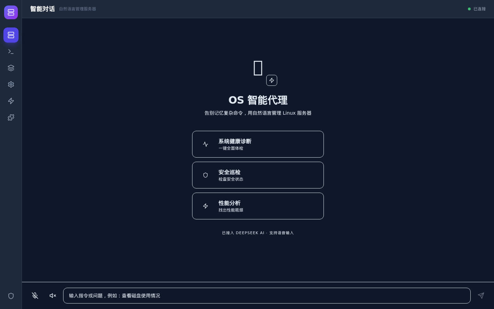
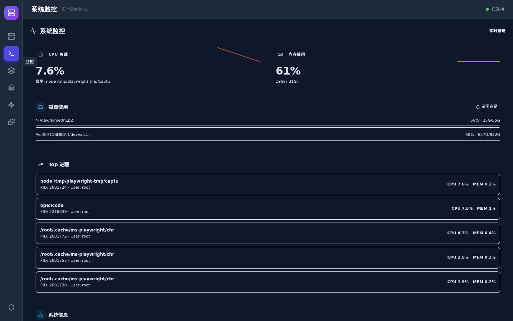
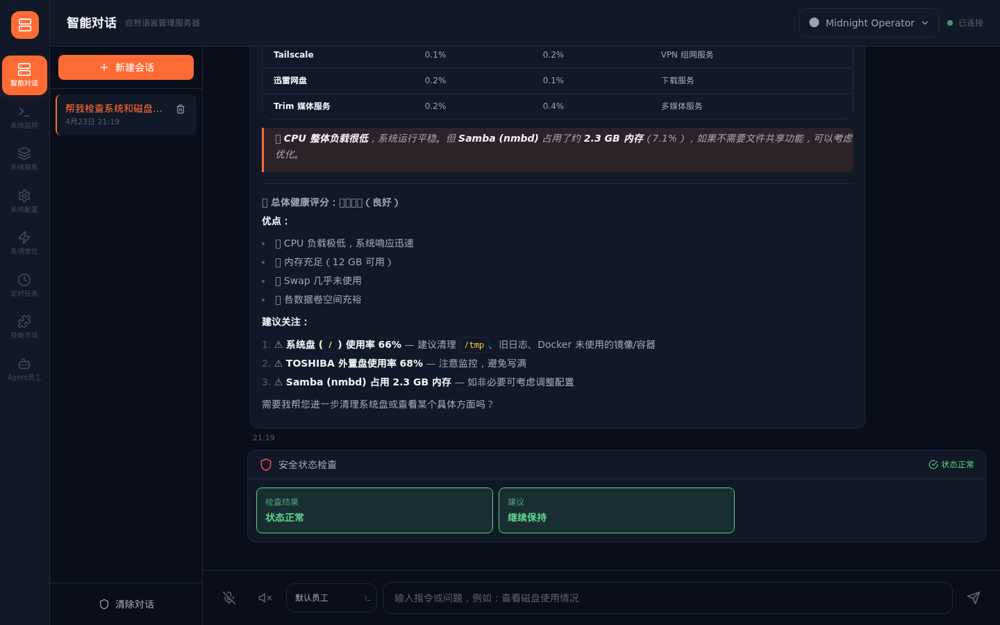

<p align="center">
  
  
  
  
  
  
</p>

<h1 align="center">🚀 OS Manager</h1>

<p align="center">
  <b>你的下一任运维，不是人类。</b>
</p>

<p align="center">
  <i>开源 AI 驱动的 Linux 服务器管理平台。像聊天一样管理服务器——它会思考、会评估风险、会自主执行。</i>
</p>

<p align="center">
  <a href="#-功能特性">功能特性</a> •
  <a href="#-快速开始">快速开始</a> •
  <a href="#-界面截图">界面截图</a> •
  <a href="#-架构">架构</a>
</p>

---

## OS Manager 是什么？

OS Manager 把 AI 变成你的 7×24 小时 Linux 运维工程师。不用再背 `tar` 参数、不用死记 `systemctl` 语法——像聊天一样打字，AI 帮你搞定一切。

与传统服务器面板不同，OS Manager 不只是显示数据。它会**思考**、**评估风险**、**解释操作**、**自主执行**——就像身边坐着一位永不休息的资深运维大佬。

<p align="center">
  
</p>

---

## 功能特性

- **🤖 自然语言操作系统管理** —— "看看磁盘还剩多少"、"优化一下 nginx"、"给我建个用户叫 john"——AI 自动把你的大白话翻译成安全可靠的 Shell 命令。
- **🎨 暗黑科技终端 UI** —— 玻璃拟态卡片 + 环境光晕，珊瑚红 + 鎏金配色。拒绝千篇一律的 AI 紫渐变，帅就一个字。
- **💬 持久化多会话隔离聊天** —— 每个会话独立上下文，互不串台，而且**重启服务不丢失**！"Docker 配置"、"安全巡检"、"Nginx 调优"随便切。
- **🎭 自定义 AI 员工** —— 创建专属 AI 员工，给每个人设定不同的角色、模型、技能和专属环境变量。"Linux 专家"和"安全审计员"各司其职。
- **🛡️ 风险评估 + 命令安全** —— 遇到危险操作自动弹出风险确认，红橙绿三色安全标签一眼看清。想手滑删库？门儿都没有！
- **📊 实时系统仪表盘** —— 磁盘、内存、CPU、进程、网络——全部玻璃卡片可视化，Socket.io 实时推送。
- **⏰ 定时 AI 任务** —— 用 cron 表达式设置定时 AI 任务："每天早上 9 点检查磁盘"、"每周一执行安全巡检"。到点自动触发，结果自动归档。
- **⚡ 一键系统优化** —— 10 大优化项，状态实时检测。自动识别 `apt`/`yum`/`dnf`，多发行版通吃。
- **🔧 智能技能系统** —— GitHub 一键装技能，无限扩展 AI 超能力。自动关键词匹配，AI 秒懂什么时候该召唤各种神技。
- **🔌 OpenCode 集成** —— 无缝连接 OpenCode CLI，AI 可以自动浏览网页、提取数据、执行多步复杂任务。
- **🎙️ 语音输入 + 语音播报** —— 说话就能下命令，AI 回复还能读出来。服务器版的 Siri！

---

## 支持的平台

| 系统家族 | 具体发行版 |
|----------|-----------|
| **Debian/Ubuntu** | Ubuntu 20.04+、Debian 11+ |
| **RHEL/CentOS** | CentOS 7/8、RHEL 8/9、AlmaLinux、Rocky Linux |
| **Fedora** | Fedora 36+ |
| **openEuler** | openEuler 20.03+、Anolis OS、openCloudOS |
| **国产系统** | 麒麟 Kylin、统信 UOS、龙蜥 Anolis |
| **其他** | 任何支持 systemd 和 Node.js 22+ 的 Linux |

**架构支持：** x86_64 / AMD64（ARM64 适配中）

---

## 快速开始

### 环境要求
- 一台 Linux 服务器（Ubuntu / CentOS / Debian / Fedora / openEuler / 龙蜥 / 麒麟等）
- root 或 sudo 权限
- OpenCode CLI（脚本会自动安装）

---

### 方式一：一键脚本部署（推荐）

支持所有主流 Linux 发行版的一键部署：

```bash
# 下载并执行安装脚本
curl -fsSL https://raw.githubusercontent.com/yourusername/os-manager/main/install.sh | sudo bash
```

脚本会自动完成：
- 检测系统发行版（Ubuntu、Debian、CentOS、RHEL、Fedora、openEuler、Anolis、Kylin 等）
- 安装 Node.js 22+（如未安装）
- 安装系统依赖（git、curl、构建工具等）
- 安装 OpenCode CLI（高级 Agent 功能）
- 构建前后端项目
- 配置 systemd 自启动服务

**部署完成后，配置 OpenCode 才能使用 AI 功能：**
```bash
opencode config set api_key=你的密钥
sudo systemctl restart os-manager
```

---

### 方式二：Docker 部署

适合需要隔离环境或快速迁移的场景：

```bash
# 克隆仓库
git clone https://github.com/yourusername/os-manager.git
cd os-manager

# 配置环境变量
cp .env.example .env
# 编辑 .env 如有需要

# 启动服务
docker-compose up -d
```

---

### 方式三：手动安装

适合开发环境或自定义部署：

```bash
# 克隆仓库
git clone https://github.com/yourusername/os-manager.git
cd os-manager

# 安装依赖
npm install

# 配置环境变量（重要！）
cp .env.example .env
# 编辑 .env 填入你的 OpenCode API Key

# 构建前端
cd frontend && npm install && npm run build && cd ..

# 构建后端
cd backend && npm install && npx tsc && cd ..

# 启动生产环境服务
node backend/dist/server.js
```

---

### 部署后配置

⚠️ **使用 AI 功能前必须配置 OpenCode：**

1. 获取 OpenCode API Key：[opencode.ai](https://opencode.ai)
2. 配置 CLI：
   ```bash
   opencode config set api_key=你的密钥
   ```
3. 重启服务生效：
   ```bash
   # systemd 安装方式
   sudo systemctl restart os-manager
   
   # Docker 方式
   docker-compose restart
   ```

4. 浏览器访问 `http://你的服务器IP:3002`，开始 AI 管理服务器之旅！🎉

### 验证安装

运行验证脚本检查部署状态：

```bash
# 一键脚本安装
sudo /opt/os-manager/check.sh

# 手动/Docker 安装
bash check.sh
```

验证项包括：Node.js 版本、服务状态、API Key 配置、端口监听、OpenCode CLI、HTTP 健康检查。

---

## 界面截图

### 🤖 智能对话界面

<p align="center">
  
</p>

> 像聊天一样管理服务器，简直不要太爽！

### 🎭 AI 员工管理

<p align="center">
  
</p>

> 创建专属 AI 员工，不同场景调用不同专家！

### 📊 系统监控仪表盘

<p align="center">
  
</p>

> 实时监控玻璃卡片，CPU 内存磁盘进程一网打尽！

### ⚡ 系统优化面板

<p align="center">
  
</p>

> 健康评分一目了然，哪里不安全点哪里！

### ⏰ 定时任务面板

<p align="center">
  
</p>

> cron 表达式设置 AI 定时任务，到点自动执行，结果自动归档。

### 🔧 技能市场

<p align="center">
  
</p>

> GitHub 装技能，无限扩展 AI 超能力！

### 🔧 系统服务面板

<p align="center">
  
</p>

> systemd 服务可视化，点一下就能操控，告别死记硬背！

---

## OS Manager 与传统工具对比

| | SSH 终端 | 传统面板 | OS Manager |
|---|---|---|---|
| **学习成本** | 陡峭如山 | 中等 | 零门槛 |
| **安全性** | `rm -rf /` 随时发生 | 只读监控 | 风险评估 + 二次确认 |
| **执行能力** | 纯手动打字 | 只看不干 | AI 自主执行 |
| **监控** | `htop` + `df` + `free` 拼凑 | 纯图表 | 统一仪表盘 + AI 洞察 |
| **优化** | 手动操作，容易翻车 | 无 | 一键优化，可回退 |
| **自动化** | 手写 crontab | 仅告警 | 可视化定时 AI 任务 |
| **查文档** | 疯狂 Google | 查 Wiki | AI 每一步都解释 |

---

## 架构

```
┌──────────────┐     ┌──────────────┐     ┌──────────────────┐
│   React 19   │────>│  Express     │────>│   JSON 文件      │
│   前端       │<────│  + Socket.io │<────│   (会话、员工、  │
└──────────────┘     └──────┬───────┘     │    任务)         │
                            │             └──────────────────┘
                     ┌──────┴───────┐
                      │  OpenCode    │
                     │  AI 引擎     │
                     └──────────────┘
```

| 层级 | 技术 |
|------|------|
| **前端** | React 19 + TypeScript + Tailwind CSS |
| **后端** | Node.js + Express + TypeScript + Socket.io |
| **AI 引擎** | OpenCode CLI |
| **定时调度** | node-cron |
| **数据持久化** | JSON 文件存储（零配置） |
| **语音** | Web Speech API + TTS |
| **字体** | Bricolage Grotesque、JetBrains Mono |

---

## API 速查

| 接口 | 方法 | 说明 |
|------|------|------|
| `/api/health` | GET | 服务健康检查 |
| `/api/agents` | GET/POST | 列出 / 创建 AI 员工 |
| `/api/agents/:id` | PUT/DELETE | 更新 / 删除员工 |
| `/api/scheduled-tasks` | GET/POST | 列出 / 创建定时任务 |
| `/api/scheduled-tasks/:id` | PUT/DELETE | 更新 / 删除任务 |
| `/api/scheduled-tasks/:id/run` | POST | 手动执行任务 |
| `/api/dashboard` | GET | 聚合系统状态 |
| `/api/skills` | GET | 列出已安装技能 |

完整 API 参考请查看源代码。

---

## 适合谁用？

- 🧑‍💻 **独立开发者** —— 自己管 VPS，但真的不想背 Linux 命令
- 🏢 **小团队** —— 没有专职运维，又想稳定不出事
- 🎓 **学生党** —— 学 Linux 的最佳安全网，随便玩不怕崩
- 🏠 **Homelab 玩家** —— 想要一个颜值爆表的服务器仪表盘
- 👔 **技术负责人** —— 让团队安全管服务器，不怕手滑误操作

---

## 开源协议

MIT 许可证 —— 随意用、随便改、放心商用！详见 [LICENSE](LICENSE)。

---

<p align="center">
  用 ❤️ 和无数杯 ☕ 写成
</p>

<p align="center">
  <i>如果 OS Manager 帮你躲过了一次 <code>sudo rm -rf</code>，记得点个 ⭐ 再走！</i>
</p>
